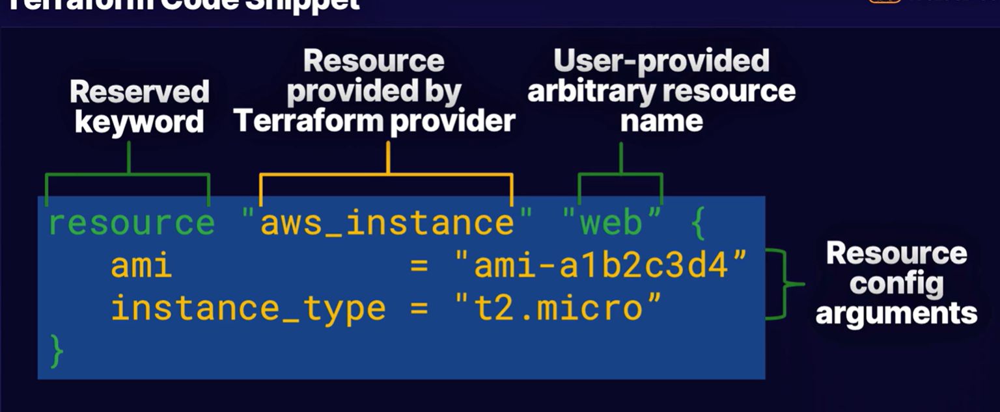
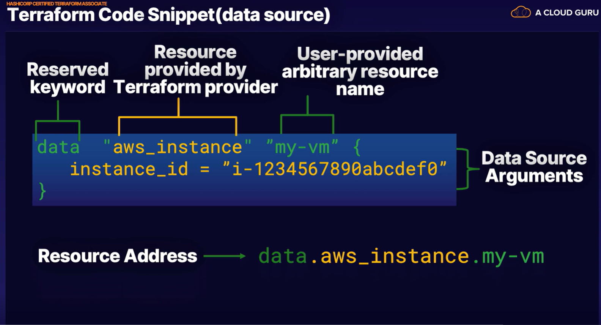
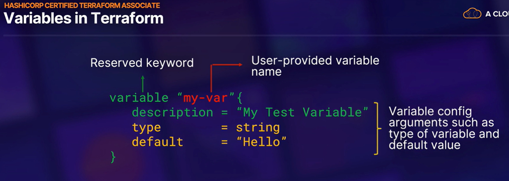

# Terraform-Study-Notes

**Greetings! So I'm finally done with my Docker studies. I'm going to focus on Terraform next because there just isn't a ton of resources on A Cloud Guru for it. So I think it will be quick. I'm going to be focusing on Python and Azure projects after that for quite some time. So once again, I'll be publicly documenting my notes. You definitely need Infrastructure as Code (IaC) for cloud and DevOps practices so lets get the cloud-agnostic tool ready to go.**

## 01.04.2025

**Today's Topics**

* Hashicorp Certified Terraform Associate (Chapter 1 - )

So, I'll be going through this course because there just aren't a ton of Terraform courses on A Cloud Guru. I may do Terraform with Azure as well but we'll see. I'm not testing for any certifications so I'll strictly be watching the videos and completing the labs. 

`terraform init` initializes the working directory that contains your Terraform code. This will download modules and plugins. It will also set up the backend for storing Terraform state files. Think of it like `yum install` and `systemctl start` and  `enable`.

Use the `terraform plan` command to review your Terraform code to see if it's doing what you intended it to do. At this stage, authentication credentials are used to connec to to your infrastructure, if required. 

`terraform apply` deploys the instructions and statements in the code. This also updates the deployment state tracking mechanism file, a.k.a "state file". 

`terraform destroy` destroys are the resources tracked by the state file. It's irreversible so be careful. 

You have to specify the cloud provider. It looks like

provider "azure" {
}

Lets look at the Terraform file. 

You can access this resource in your Terraform code by using the resource type and the resource name. So in the above case, you would use `aws_instance.web`.

You have a data type that will fetch info from an already existing resource. Pretty useful. 

Terraform executes code in files with the `.tf` extension. 

Lab 1 - Deploying a VM in AWS Using the Terraform Workflow

So we're going to do exactly as the title of the lab says. They gave us the code for the `main.tf` file. First off, thank GOD for Linux and me going through those courses. I didn't even really realize that I didn't need to go into AWS / Azure portal and then go into their shells in order to run these commands. I just SSH'd into the server itself and created the directory and file I needed to run this lab. Yes, they gave me the code for the `main.tf` file but I knew how to manipulate the code very quickly and funnel information from the resource ID file into the `main.tf` file. Then you simply do terraform init, pla, apply, and destroy. I checked using `aws ec2 describe-instances | grep <vm-name>` to see if the VM was actually created. I received an output so it's definitely there. 

________________

Chapter 4 - Terraform Fundamentals

You have a few ways to install Terraform. One was is to download the zipped binary from the Hashicorp website. unzip the Terraform binary on your Linux server. Then add the path to your `$PATH` environment variable. Move the terraform file to the `/bin/ folder. 

Another way is to download the Terraform repo from the website and install it yourself. This would be similar to how we were installing Docker manually. It's nice because they lay out all the commands from `yum-utils` and etc out on the Install Terraform on the Hashicorp Website. Be sure to google this. 

Terraform state is for resource tracking. It's a way to keep tabs on what has been deployed. You have your Terraform config file. You then have a Terraform state file that's in JSON that keeps tabs of what has been created or destroyed. It's stored locally in the `terraform.tfstate` file with your other Terraform files. 

You can define variables in your Terraform code as well. 

To reference a variable, use `var.<var-name>`. A best practice is to define all of your variables beforehand and put them in a separate file called `terraform.tfvars`.

You can create validation features for variable as well. Think of it like a script that gives a message and error code in Linux. You give it a condition and an error message. 

Terraform variables can be a string, number or bool. These are the base variables. The complex type variables are list, set, map, object, and tuple. 

You also have Terraform output values that you can write. Think of it as basically validation for a successful deploy. You tell it what you want it to tell you after the deployment is successful. If you get the output you wrote, then you know everything went well. 

A Terraform Provisioner is a command or script that will run at the create runtime or the destroy runtime. Provisioners are not mentioned or managed in the Terraform plan command. So you basically will only be able to see if when Terraform is showing you all the actions it's taking mid apply or mid destroy. 

Lab 2 - Installing Terraform and Working with Terraform Providers

We basically installed Terraform using the zip version. We used `wget` to get the zip file from the Hashicorp website. Then unzipped and installed in in the `/usr/sbin` directory. Once we created out main.tf file, we were able to do `terraform init` and go from there. We also checked to see if the resources were actually created in the AWS Management Console (portal?). I was struggling to navigate the portal but that's okay. 

Lab 3 - Using Terraform Provisioners to Set Up an Apache Web Server on AWS

This one was interesting. We used `git clone` to fetch the files from a GitHub repo. The repo had a `main.tf` file and a `setup.tf` file. The main file created the Linux VM or whatever and we used a Provisioner to make it install and enable HTTPD. We also put some info into the index.html file so we could view it in our web browser. The setup file had a ton of info. Mostly just creating subnets, IGWs, and a routing table. I'll need to go over this. Not sure how all of this works on AWS. Actually, I'm not entirely sure what result they would be aiming to get on Azure as well. 

The instructor used an output variable to display the Web server's PIP. I curled the IP and pasted it in my URL. It had the title I was looking for in both actions. 

My question here is, I feel like Terraform had to apply the `setup.tf` file first before it was able to execute the `main.tf` file. How did it know the order? Which exactly was the order? I thought `main.tf` had supremacy. I'll ask Chat GPT. 

I asked Chat GPT and basically Terraform looks at all `.tf` files and determines which resources require which dependencies. It then creates a map for which resources to deploy first so that everything can be deployed. So it looked at both the `setup.tf` and `main.tf` files and figured the `setup.tf` resources were needed before it could do anything with the `main.tf` instructions. That is really amazing!

________________

Chapter 5 - Terraform State

The Terraform state command is a utility for manipulating and reading the Terraform State file. It's for advanced statement management. The sub commands are terraform state list, rm, and show. 

